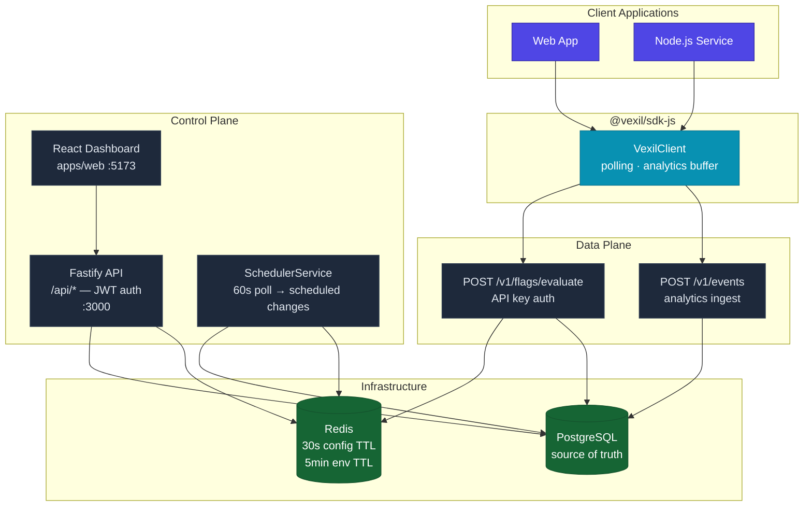
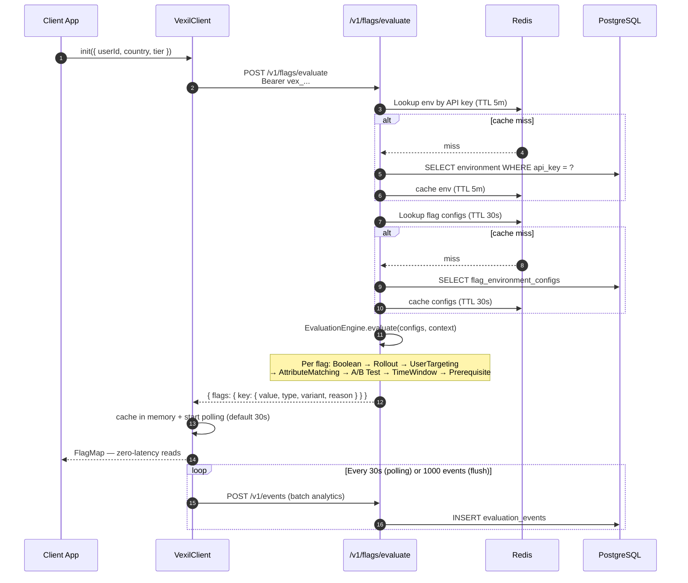
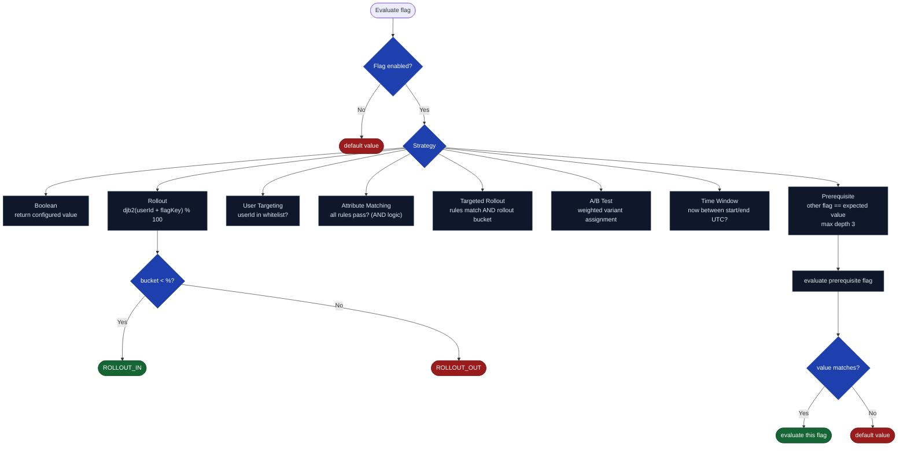
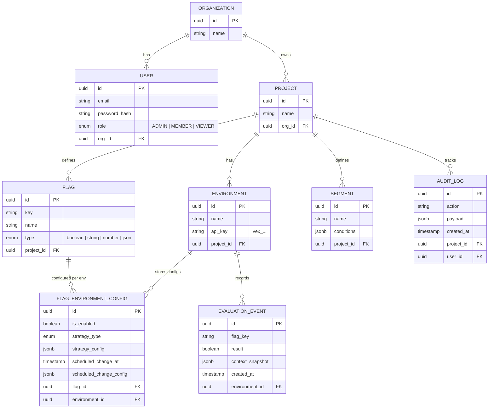
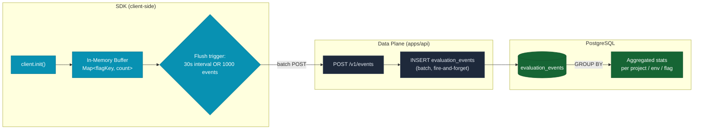

# Vexil

> Self-hosted feature flag platform — deterministic rollouts, multiple targeting strategies, real-time evaluation, and a built-in analytics pipeline.

---

## Repository Layout

```
vexil/
├── apps/
│   ├── api/          # Fastify backend — control + data plane
│   └── web/          # React admin dashboard
├── packages/
│   ├── sdk-js/       # @vexil/sdk-js — JS/TS SDK (publishable npm package)
│   └── types/        # @vexil/types — shared TypeScript types
├── docker-compose.yml
└── railway.toml      # Railway deployment config
```

---

## Architecture



---

## Flag Evaluation Flow



---

## Evaluation Strategies



---

## Data Model



---

## Analytics Pipeline



---

## Getting Started (Local Dev)

### Prerequisites

- Node.js >= 18
- Docker (PostgreSQL + Redis via `docker-compose.yml`)
- npm >= 9

### 1. Clone and install

```bash
git clone https://github.com/your-org/vexil.git
cd vexil
npm install
```

### 2. Start infrastructure

```bash
docker compose up -d
# PostgreSQL on :5432, Redis on :6379
```

### 3. Configure the API

```bash
cd apps/api
cp .env.example .env
```

| Variable | Default | Description |
|---|---|---|
| `PORT` | `3000` | Fastify listen port |
| `DB_HOST` | `127.0.0.1` | PostgreSQL host |
| `DB_PORT` | `5432` | PostgreSQL port |
| `DB_USER` | `postgres` | PostgreSQL username |
| `DB_PASS` | `postgres` | PostgreSQL password |
| `DB_NAME` | `vexil` | Database name |
| `REDIS_HOST` | `127.0.0.1` | Redis host |
| `REDIS_PORT` | `6379` | Redis port |
| `JWT_SECRET` | `vexil-dev-secret` | Change in production |
| `NODE_ENV` | `development` | Set to `test` for in-memory Redis mock |

### 4. Start API + dashboard

```bash
# From monorepo root
npm run dev:api    # API at http://localhost:3000  |  Swagger at http://localhost:3000/docs
npm run dev:web    # Dashboard at http://localhost:5173
```

Register an account → create a project → add environments → create flags → configure strategies.

---

## SDK Quick Start

### Install

```bash
npm install @vexil/sdk-js
```

### Basic usage

```typescript
import { VexilClient } from "@vexil/sdk-js";

const client = new VexilClient({
  apiKey: "vex_...",                  // environment API key from Dashboard → Environments
  baseUrl: "https://api.example.com",
  pollingInterval: 30_000,            // re-fetch flags every 30s (default)
  onFlagsUpdated: (flags) => console.log("flags refreshed", flags),
  onError: (err) => console.error(err),
});

// Fetch flags for a user context — call once at startup
await client.init({ userId: "u_42", country: "IN", tier: "premium" });

// Zero-latency reads from in-memory cache
if (client.isEnabled("new-checkout")) {
  renderNewCheckout();
}

const theme = client.getValue<string>("ui-theme", "light");   // typed with fallback
const limit = client.getValue<number>("rate-limit", 100);

// Switch user context (e.g. on login)
await client.identify({ userId: "u_99", tier: "free" });

// Graceful shutdown — flushes analytics and stops polling
await client.destroy();
```

### EvaluationContext

Any key you pass in the context is forwarded to the API for attribute matching rules.

```typescript
await client.init({
  userId: "u_42",          // used for rollout bucketing + user targeting
  country: "US",           // available for attribute matching
  plan: "pro",             // custom attribute
  betaTester: true,        // custom attribute
});
```

### Strategy config reference

| Strategy | Required `strategyConfig` fields |
|---|---|
| `boolean` | `value: boolean` |
| `rollout` | `percentage: number (0–100)`, `hashAttribute: string` |
| `user_targeting` | `userIds: string[]`, `hashAttribute: string`, `fallthrough: boolean` |
| `attribute_matching` | `rules: TargetingRule[]` |
| `targeted_rollout` | `percentage`, `hashAttribute`, `rules: TargetingRule[]` |
| `ab_test` | `variants: { key, value, weight }[]` (weights sum to 100), `hashAttribute: string` |
| `time_window` | `startDate: string (ISO)`, `endDate: string (ISO)`, `timezone?: string` |
| `prerequisite` | `flagKey: string`, `expectedValue: unknown` |

> `hashAttribute` defaults to `"userId"` in the dashboard. It determines which context field is used for deterministic bucketing.

---

## Demo App

A standalone demo exercises all strategy types end-to-end.

```bash
# Prerequisites: API running on :3000, flags configured in dashboard
cd /path/to/vexil-demo
cp .env.example .env      # set VEXIL_API_KEY from Dashboard → Environments → Show key
npm install
npm run demo
```

Expected output — each flag resolves with a reason code:

| Flag | Strategy | Alice (pro, US) | Charlie (free, DE) |
|---|---|---|---|
| `boolean-test-flag` | Boolean | `ENABLED` | `ENABLED` |
| `rollout-test-flag` | Rollout 50% | `ROLLOUT_OUT` | `ROLLOUT_IN` |
| `user-targeting-test-flag` | User Targeting | `USER_WHITELIST` | `USER_FALLTHROUGH` |
| `ab-test-flag` | A/B Test | `AB_VARIANT` | `AB_VARIANT` |

---

## Deployment (Railway)

Config in `railway.toml` — two services: `api` and `web`.

**API env vars:**

| Variable | Description |
|---|---|
| `DATABASE_URL` | PostgreSQL connection string (Railway plugin) |
| `REDIS_URL` | Redis connection string (Railway plugin) |
| `JWT_SECRET` | Random secret, min 32 chars |
| `NODE_ENV` | `production` |
| `PORT` | `3000` |

**Web env vars:**

| Variable | Description |
|---|---|
| `VITE_API_URL` | Deployed API URL, e.g. `https://vexil-api.up.railway.app` |

---

## Features

| Area | Capabilities |
|---|---|
| Auth | JWT register/login, RBAC (ADMIN / MEMBER / VIEWER) |
| Management | Projects, Environments, Flags CRUD, API key rotation |
| Strategies | Boolean, Rollout, User Targeting, Attribute Matching, Targeted Rollout, A/B Test, Time Window, Prerequisite |
| Targeting | Segment builder with visual rule editor |
| Scheduling | Per-flag scheduled activation with `scheduledAt` |
| Analytics | Evaluation event buffering, pass-rate dashboard |
| Audit | Full audit log per project |
| Performance | Redis cache (30s config / 5min env TTL), cache-busted on save |
| SDK | JS/TS — polling, analytics buffering, typed API |
| API Docs | Swagger UI at `/docs` |

---

**Vexil — Performance + Determinism + Developer Experience**
