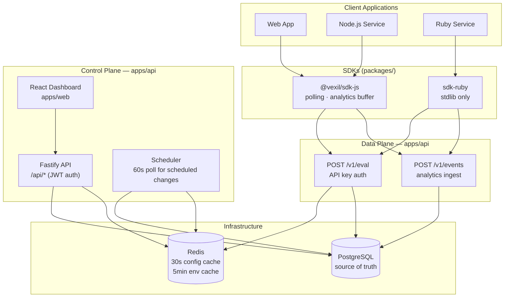
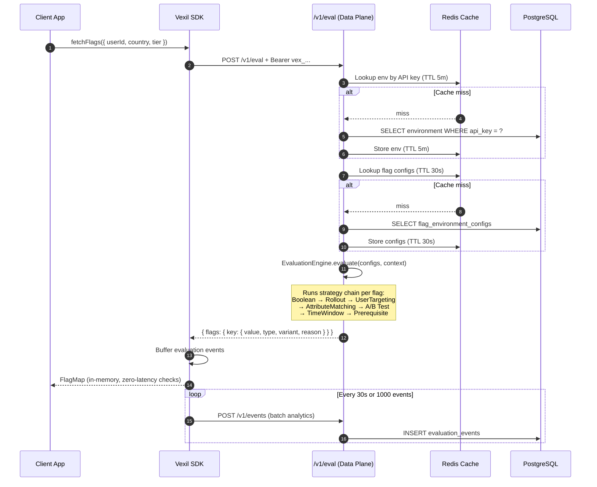
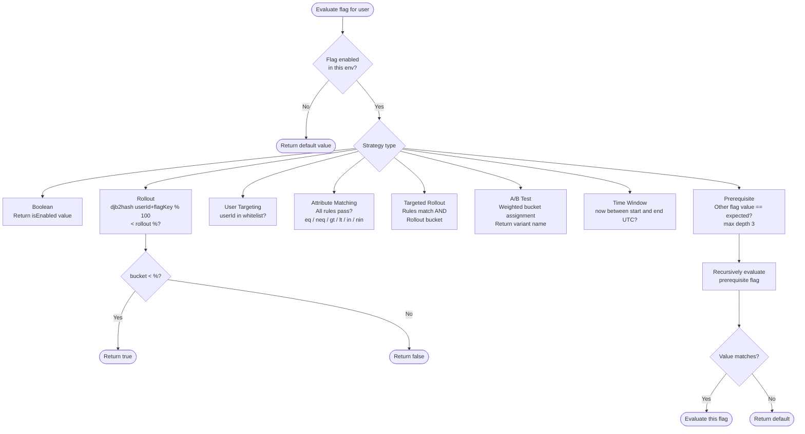
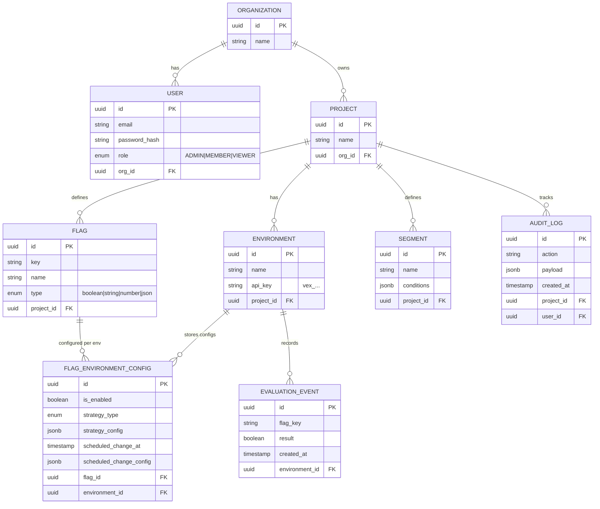
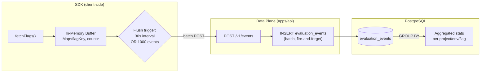

# Vexil

> High-performance, open-source feature flag service with local evaluation and deterministic rollouts.

---

## Repository Layout

```
vexil/
├── apps/
│   ├── api/          # Fastify backend — Control + Data plane API
│   └── web/          # React 19 admin dashboard
├── packages/
│   ├── sdk-js/       # @vexil/sdk-js — publishable npm SDK
│   ├── sdk-ruby/     # Ruby SDK (stdlib only, no gem required)
│   └── types/        # @vexil/types — shared TypeScript types
├── docker-compose.yml
├── railway.toml
└── package.json      # npm workspaces root
```

---

## Architecture



---

## Flag Evaluation Flow



---

## Evaluation Strategies



---

## Data Model



---

## Analytics Pipeline



---

## Getting Started (Local Dev)

### Prerequisites

- Node.js >= 18
- Docker (for PostgreSQL + Redis)
- npm >= 9

### 1. Clone and install

```bash
git clone https://github.com/your-org/vexil.git
cd vexil
npm install
```

### 2. Start infrastructure

```bash
docker compose up -d
# Starts: PostgreSQL on :5433, Redis on :6379
```

### 3. Configure the API

```bash
cd apps/api
cp .env.example .env
```

| Variable | Default | Description |
|---|---|---|
| `PORT` | `3000` | Fastify listen port |
| `DB_HOST` | `127.0.0.1` | PostgreSQL host |
| `DB_PORT` | `5433` | PostgreSQL port |
| `DB_USER` | `postgres` | PostgreSQL username |
| `DB_PASS` | `postgres` | PostgreSQL password |
| `DB_NAME` | `vexil` | Database name |
| `REDIS_HOST` | `127.0.0.1` | Redis host |
| `REDIS_PORT` | `6379` | Redis port |
| `JWT_SECRET` | `vexil-dev-secret` | **Change in production** |
| `NODE_ENV` | `development` | Set `test` for in-memory Redis mock |

### 4. Start the API

```bash
npm run dev:api
# API: http://localhost:3000
# Swagger UI: http://localhost:3000/docs
```

### 5. Start the dashboard

```bash
npm run dev:web
# Dashboard: http://localhost:5173
```

Register an account, create a project, add environments and flags.

---

## SDK Quick Start

### JavaScript / TypeScript

```bash
npm install @vexil/sdk-js
```

```typescript
import { VexilClient } from "@vexil/sdk-js";

const client = new VexilClient({
  apiKey: "vex_...",            // environment API key from the dashboard
  baseUrl: "https://api.example.com",
  pollingInterval: 60_000,      // optional: re-fetch every 60s
});

await client.fetchFlags({ userId: "u_42", country: "IN", tier: "premium" });

if (client.isEnabled("new-checkout")) {
  renderNewCheckout();
}

const theme = client.getValue<string>("ui-theme");   // "dark" | "light"
const limit = client.getValue<number>("rate-limit"); // 100

await client.destroy(); // flush analytics + stop timers on shutdown
```

### Ruby

```ruby
# No gem required — copy packages/sdk-ruby/lib/vexil.rb into your project
require_relative "vexil"

client = Vexil::Client.new(
  api_key: "vex_...",
  base_url: "https://api.example.com"
)

client.fetch_flags(userId: "u_42", country: "IN", tier: "premium")

render_new_checkout if client.enabled?("new-checkout")
theme = client.value("ui-theme", "light")
```

---

## Deploying to Railway

Railway runs `apps/api` and `apps/web` as separate services using the Dockerfiles in each directory.

### Steps

1. Push this repo to GitHub.
2. In the Railway dashboard, create a **New Project → Deploy from GitHub repo**.
3. Add two services: one for `apps/api`, one for `apps/web`.
4. Attach a **PostgreSQL** and **Redis** plugin to the project.
5. Set environment variables per service (see table above for API; set `VITE_API_BASE_URL` for web to the deployed API URL).
6. Deploy.

Railway will use `railway.toml` at the repo root to configure build and deploy settings.

---

## Working Features

| Feature | Status |
|---|---|
| JWT authentication (register / login) | Done |
| Projects, Environments, Flags CRUD | Done |
| API key generation + rotation | Done |
| Boolean, Rollout, Targeted Rollout strategies | Done |
| User Targeting, Attribute Matching strategies | Done |
| A/B Test, Time Window, Prerequisite strategies | Done |
| Segments with visual rule builder | Done |
| Per-environment flag configuration | Done |
| Scheduled flag changes | Done |
| Analytics dashboard (evaluations, pass rate) | Done |
| Audit logs | Done |
| Redis caching (30s config / 5min env TTL) | Done |
| JS/TS SDK with polling + analytics buffering | Done |
| Ruby SDK | Done |
| Swagger UI at `/docs` | Done |
| RBAC (ADMIN / MEMBER / VIEWER) | Done |

---

**Vexil — Performance + Determinism + Developer Experience**
