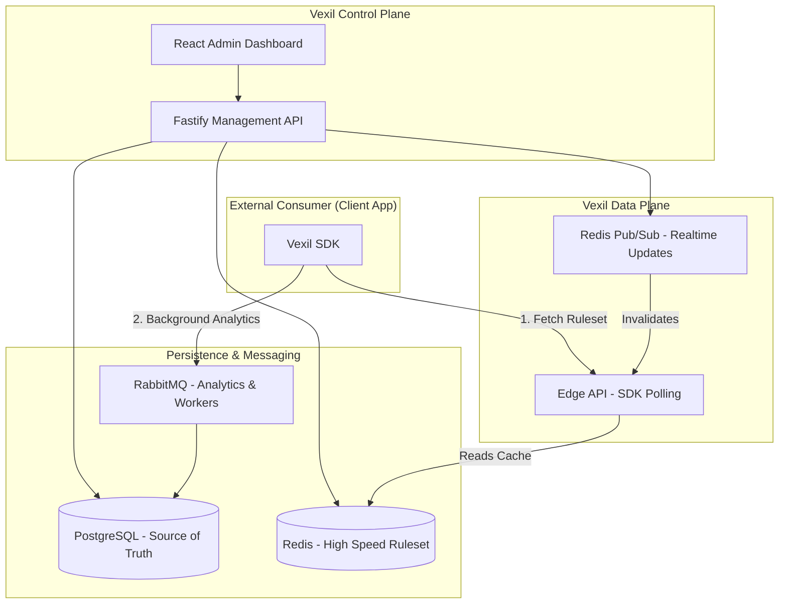
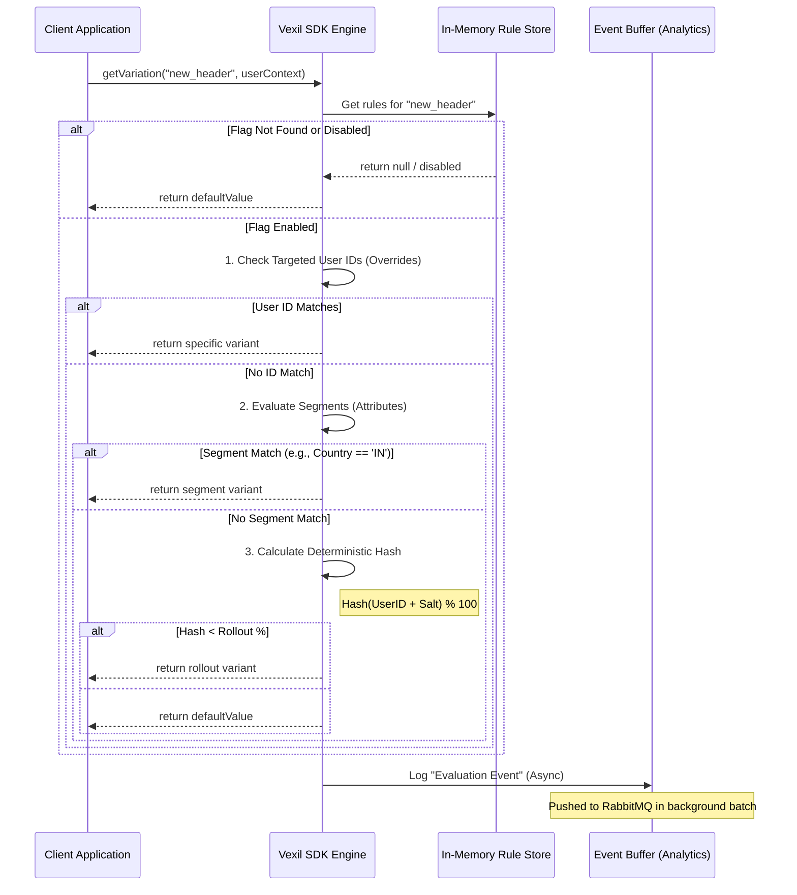
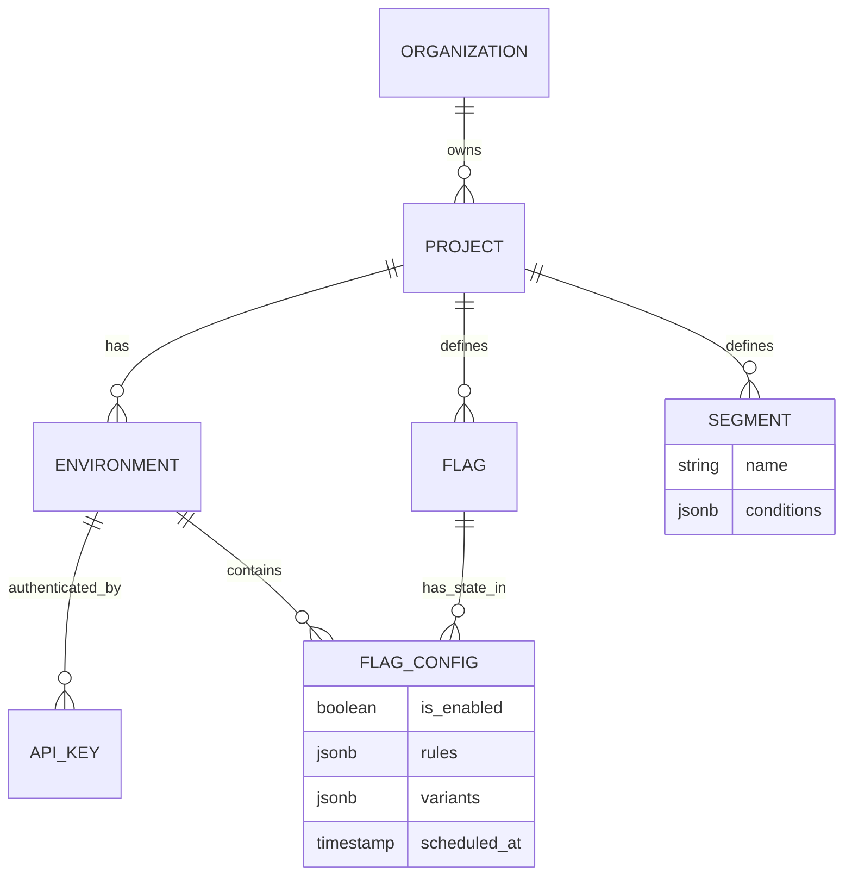

# 🚩 Vexil

> **Vexil** — A high-performance, open-source feature flag and remote configuration service with local evaluation and deterministic rollouts.

---

## ✨ Key Highlights

- 🚀 **Sub-millisecond Latency**: Rules are processed locally in the SDK, avoiding network round-trips for every flag check.
- ⚖️ **Deterministic Rollouts**: Consistent hashing for "sticky" percentage-based traffic splitting.
- 🌍 **Environment Isolation**: Native support for Development, Staging, and Production with unique API keys.
- 🎯 **Advanced Targeting**: Segment users by region, subscription tier, or custom metadata.
- 🛠️ **Enterprise Tech Stack**: Powered by **Fastify**, **Node.js**, **PostgreSQL**, **Redis**, and **RabbitMQ**.
- 📦 **Multi-SDK Support**: Support for TypeScript, Go, Java and Ruby.

---

# 🏗️ High-Level Design (HLD)

Vexil is split into the **Control Plane** (Management) and the **Data Plane** (High-speed Delivery).



---

# 📦 SDK Integration

## General Workflow

1. **Initialize**: Provide your Environment API Key.
2. **Context**: Pass a JSON object containing user attributes (ID, location, etc.).
3. **Check**: Call the variation method to evaluate the flag locally.

---

## 🟢 TypeScript / Node.js

```typescript
import { VexilClient } from "@vexil/node-sdk";

const vexil = new VexilClient("vex_dev_key_123");

const userContext = {
  id: "user_88",
  country: "IN",
  tier: "premium",
};

// Local evaluation - no network latency
if (vexil.getVariation("beta_feature", userContext)) {
  renderNewDashboard();
} else {
  renderOldDashboard();
}
```

---

## 🔵 Go

```go
package main

import (
	"github.com/vexil-io/go-sdk"
)

func main() {
	client := vexil.NewClient("vex_prod_key_abc")

	user := vexil.Context{
		"id":     "user_88",
		"tier":   "free",
		"region": "APAC",
	}

	if client.IsEnabled("new_search_algo", user) {
		// Run new algorithm
	}
}
```

---

## ☕ Java

```java
VexilClient client = new VexilClient("vex_prod_key_abc");

VexilContext context = new VexilContext()
    .add("id", "user_88")
    .add("tier", "premium");

if (client.getVariation("ui_v2_enabled", context, false)) {
    // Show new UI
}
```

---

## 🔴 Ruby (Rails)

```ruby
user_context = { id: 'user_88', tier: 'premium' }

if Vexil.get_variation('promo_banner', user_context)
  # Show banner
end
```

---


# 1️⃣ Local Evaluation Sequence Diagram

Internal lifecycle of a `getVariation` call within the SDK.  
It **never leaves the application process**.



---

# 2️⃣ Rule Engine Logic (LLD)

To implement this consistently across TypeScript, Go, and Java, we define a standard evaluation algorithm.

---

## A. Hashing Algorithm (Consistent Selection)

We use **MurmurHash3 (32-bit)**:
- Fast
- Excellent distribution
- Available in every major language

### Logic

1. Take the `userId` (or fallback unique identifier).
2. Append a **salt** (unique per flag) to prevent correlated rollouts.
3. Generate hash.
4. Take absolute value.
5. Apply modulo 100.

```typescript
function getBucket(userId: string, salt: string): number {
  const hash = murmurhash3_32(`${userId}-${salt}`);
  return Math.abs(hash) % 100;
}
```

---

## B. Segment Matching (Predicate Engine)

Supported operators:

- `eq` — Equals  
- `neq` — Not Equals  
- `gt` — Greater Than  
- `lt` — Less Than  
- `in` — In Array  
- `nin` — Not In Array  
- `regex` — Regular Expression Match  

---

# 3️⃣ Monitoring & Event Capture (Analytics)

**Does not** sends an HTTP request for every flag evaluation.

## LLD Strategy

### In-Memory Buffer

The SDK maintains:

```
Map<FlagKey, Counter>
```

---

### Debounced Flush

- Every **30 seconds**
- OR when buffer reaches **1000 events**

SDK sends one batch request:

```
POST /v1/analytics
```

---

### Ingestion Pipeline

1. Data Plane API receives batch
2. Drops payload into **RabbitMQ**
3. Worker consumes messages
4. Worker increments usage counters in PostgreSQL

---

# 4️⃣ Entity Relationship (ER) Diagram



---

# 🎯 Summary

Vexil provides:

- ⚡ Local, zero-latency flag evaluation  
- 🎯 Deterministic and consistent rollouts  
- 🧠 Advanced targeting with segment engine  
- 📊 Efficient batched analytics  
- 🏗️ Scalable control & data plane separation  

---

**Vexil = Performance + Determinism + Developer Experience**