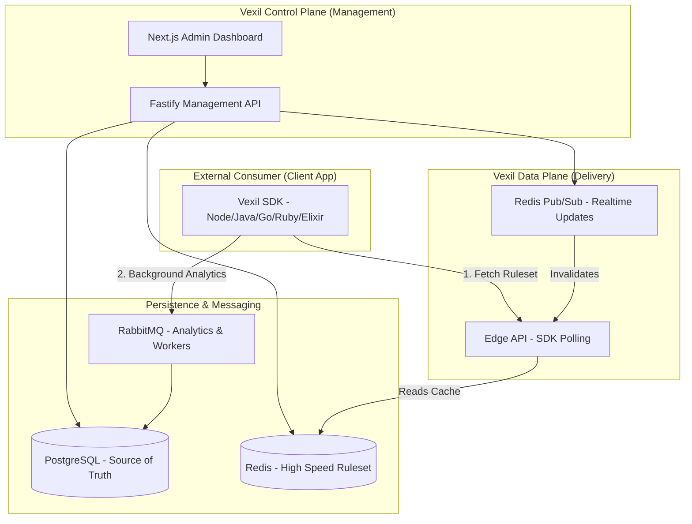

# 🚩 Vexil

> **Vexil** (Latin: _Vexillum_) — A high-performance, developer-first, self-hosted feature flag and remote configuration service.

Vexil is designed to decouple code deployments from feature releases. It enables engineering teams to perform percentage rollouts, user segmentation, and instant kill-switches across multiple environments without redeploying applications.

---

## 🏗️ High-Level Design (HLD)

Vexil is split into the **Control Plane** (Management) and the **Data Plane** (High-speed Delivery).

