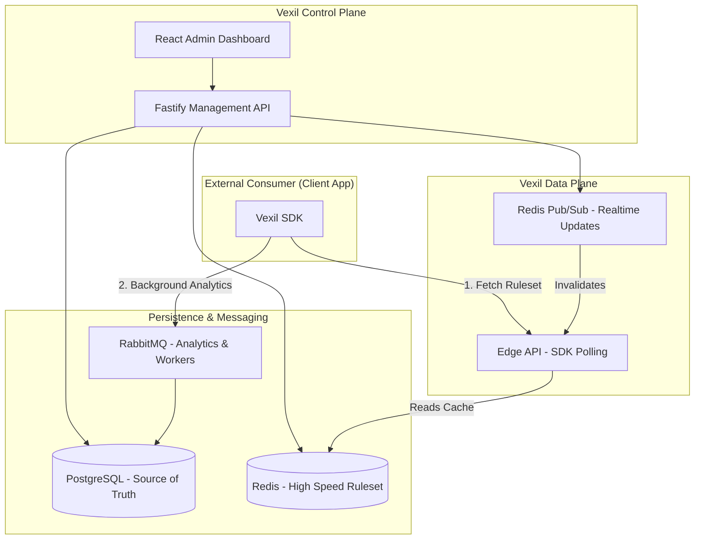

# 🚩 Vexil

> **Vexil** — A high-performance, open-source feature flag and remote configuration service with local evaluation and deterministic rollouts.

---

## ✨ Key Highlights

- 🚀 **Sub-millisecond Latency**: Rules are processed locally in the SDK, avoiding network round-trips for every flag check.
- ⚖️ **Deterministic Rollouts**: Consistent hashing for "sticky" percentage-based traffic splitting.
- 🌍 **Environment Isolation**: Native support for Development, Staging, and Production with unique API keys.
- 🎯 **Advanced Targeting**: Segment users by region, subscription tier, or custom metadata.
- 🛠️ **Enterprise Tech Stack**: Powered by **Fastify**, **Node.js**, **PostgreSQL**, **Redis**, and **RabbitMQ**.
- 📦 **Multi-SDK Support**: Support for TypeScript, Go, Java, Ruby, and Elixir.

---

## 🏗️ High-Level Design (HLD)

Vexil is split into the **Control Plane** (Management) and the **Data Plane** (High-speed Delivery).



---

## 📦 SDK Integration

### General Workflow

1. **Initialize**: Provide your Environment API Key.  
2. **Context**: Pass a JSON object containing user attributes (ID, location, etc.).  
3. **Check**: Call the variation method to evaluate the flag locally.

---

### 🟢 TypeScript / Node.js

```typescript
import { VexilClient } from '@vexil/node-sdk';

const vexil = new VexilClient('vex_dev_key_123');

const userContext = {
  id: 'user_88',
  country: 'IN',
  tier: 'premium'
};

// Local evaluation - no network latency
if (vexil.getVariation('beta_feature', userContext)) {
  renderNewDashboard();
} else {
  renderOldDashboard();
}
```

---

### 🔵 Go

```go
package main

import (
	"github.com/vexil-io/go-sdk"
)

func main() {
	client := vexil.NewClient("vex_prod_key_abc")

	user := vexil.Context{
		"id":     "user_88",
		"tier":   "free",
		"region": "APAC",
	}

	if client.IsEnabled("new_search_algo", user) {
		// Run new algorithm
	}
}
```

---

### ☕ Java

```java
VexilClient client = new VexilClient("vex_prod_key_abc");

VexilContext context = new VexilContext()
    .add("id", "user_88")
    .add("tier", "premium");

if (client.getVariation("ui_v2_enabled", context, false)) {
    // Show new UI
}
```

---

### 🔴 Ruby (Rails)

```ruby
user_context = { id: 'user_88', tier: 'premium' }

if Vexil.get_variation('promo_banner', user_context)
  # Show banner
end
```

---

### 🟣 Elixir

```elixir
user_context = %{id: "user_88", tier: "premium"}

if Vexil.get_variation("new_checkout_flow", user_context) do
  # New flow logic
end
```