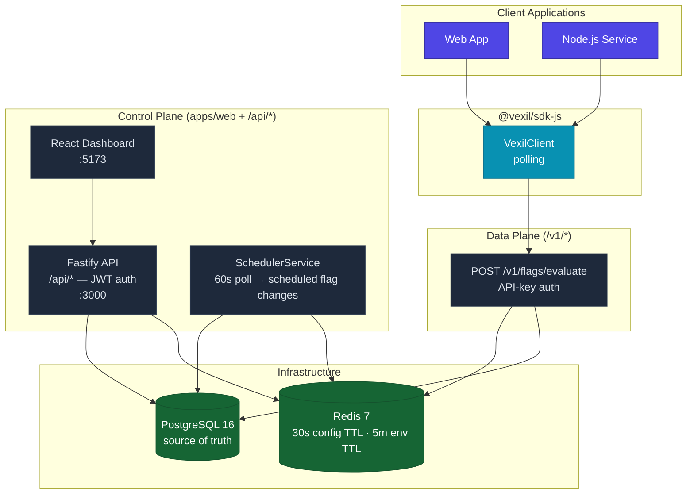
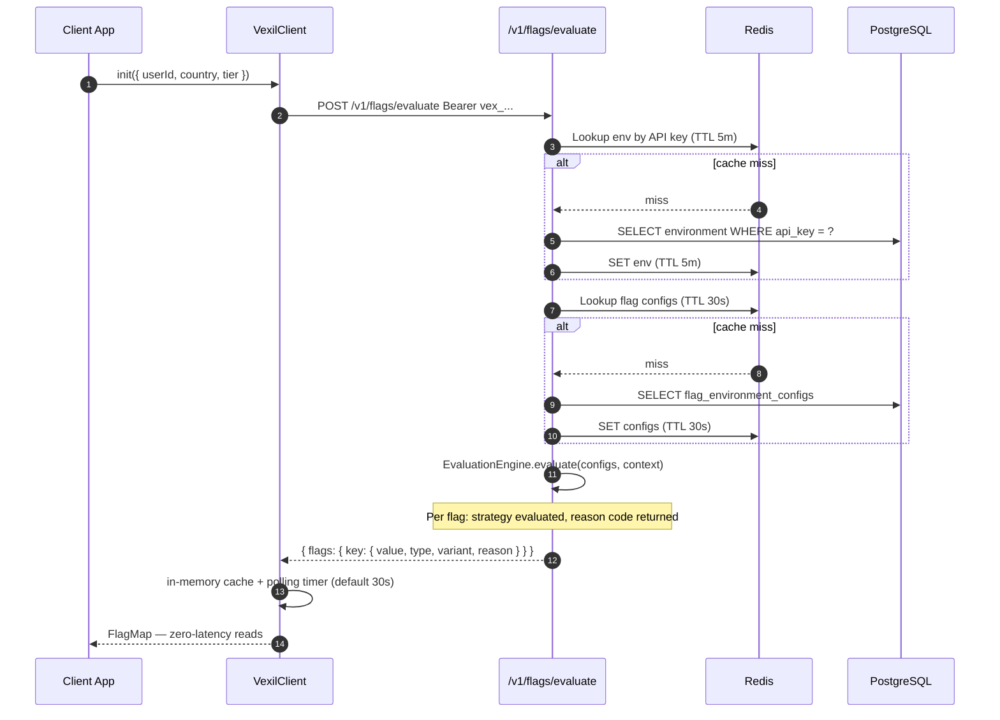
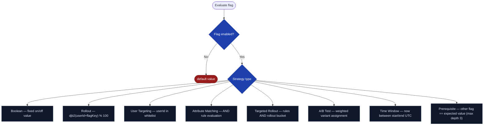
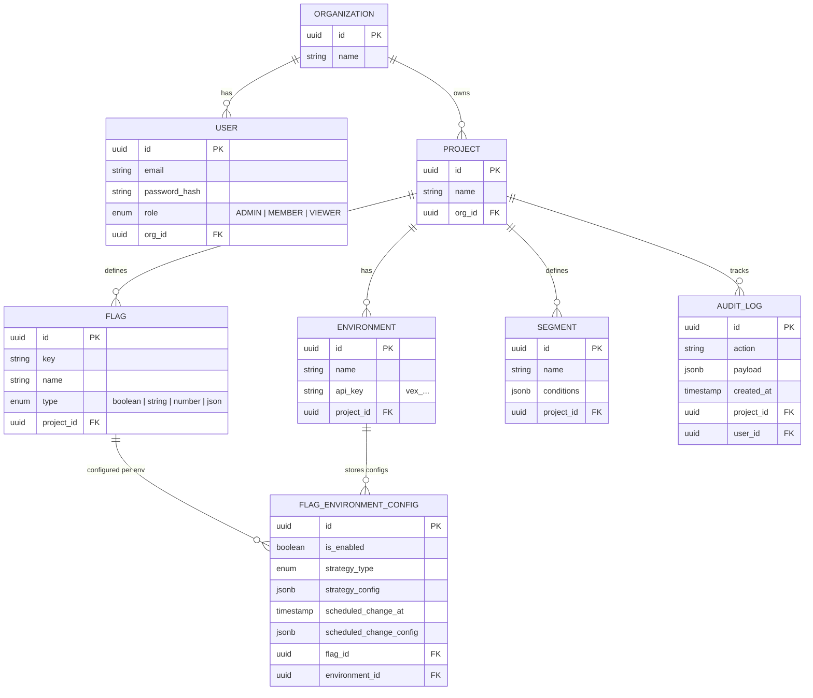

# Vexil

> Self-hosted feature flag platform — deterministic rollouts, multiple targeting strategies, and real-time evaluation.

---

## Repository Layout

```
vexil/
├── apps/
│   ├── api/          # Fastify backend — control + data plane  →  apps/api/README.md
│   └── web/          # React admin dashboard                   →  apps/web/README.md
├── packages/
│   ├── sdk-js/       # @vexil/sdk-js — JS/TS SDK (npm package) →  packages/sdk-js/README.md
│   └── types/        # @vexil/types — shared TypeScript types
└── docker-compose.yml
```

**Per-service setup guides live in each service's own README.** This document covers the overall system architecture, data model, and evaluation design.

---

## Service Architecture



### Two-plane design

| Plane | Prefix | Auth | Purpose |
|-------|--------|------|---------|
| Control | `/api/*` | JWT (8h) | Dashboard CRUD — projects, flags, environments |
| Data | `/v1/*` | API key (`vex_…`) | SDK flag evaluation |

---

## Flag Evaluation Flow



---

## Evaluation Strategies

Eight strategies are evaluated in strict priority order per flag:



| Strategy | Key config fields |
|----------|-------------------|
| `boolean` | `value: boolean` |
| `rollout` | `percentage: 0–100`, `hashAttribute` |
| `user_targeting` | `userIds: string[]`, `hashAttribute`, `fallthrough` |
| `attribute_matching` | `rules: TargetingRule[]` |
| `targeted_rollout` | `percentage`, `hashAttribute`, `rules` |
| `ab_test` | `variants: { key, value, weight }[]` (sum to 100), `hashAttribute` |
| `time_window` | `startDate`, `endDate` (ISO 8601), `timezone?` |
| `prerequisite` | `flagKey`, `expectedValue` |

> `hashAttribute` (default `"userId"`) is the context field used for deterministic bucketing. Rollout results are stable per user per flag.

---

## Data Model



---

## Caching Strategy

| Cache key | TTL | Invalidated on |
|-----------|-----|----------------|
| `env_apikey:{apiKey}` | 5 min | Environment update |
| `env_configs:{environmentId}` | 30 s | Flag config save |
| `eval_bucket:{apiKey}` | rolling | Token-bucket rate limit |

---

## Docker Compose (Recommended — full stack in one command)

Runs PostgreSQL, Redis, the API, and the web dashboard together. The API container automatically runs database migrations before accepting traffic.

```bash
# 1. Create your env file and set JWT_SECRET
cp .env.example .env
# Edit .env — at minimum, change JWT_SECRET:
#   JWT_SECRET=$(openssl rand -hex 32)

# 2. Build images and start everything
docker compose up --build
```

**What happens on first run:**

```
postgres  → starts, waits until pg_isready
redis     → starts, waits until redis-cli ping
api       → waits for postgres + redis to be healthy
            runs run_start.sh:
              [startup] Running database migrations...
              [startup] Applied migration: InitialSchema1744588800000
              [startup] Migrations complete.
              [startup] Starting Vexil API server...
web       → waits for api /health to return 200
            serves the React dashboard via nginx
```

**Subsequent runs** (images already built):

```bash
docker compose up
# Migrations are idempotent — "No pending migrations" on a current schema
```

**Ports:**

| Service | Host URL |
|---------|----------|
| PostgreSQL | `localhost:5432` |
| Redis | `localhost:6379` |
| API | `http://localhost:3000` — Swagger: `/docs` |
| Web | `http://localhost:5173` |

**Useful commands:**

```bash
# Rebuild only the api image after code changes
docker compose up --build api

# View api logs
docker compose logs -f api

# Stop everything (keeps volumes)
docker compose down

# Stop and delete all data (volumes)
docker compose down -v

# Run a one-off migration manually inside the running container
docker compose exec api sh -c "node -e \"const {AppDataSource}=require('./dist/data-source');AppDataSource.initialize().then(ds=>ds.runMigrations()).then(()=>process.exit(0))\""
```

---

## Quick Start (Local Dev — without Docker for the API)

> Full setup instructions are in each service's README. This is the three-command path.

```bash
# 1. Install all workspaces
npm install

# 2. Start PostgreSQL + Redis only
docker compose up -d postgres redis

# 3. Copy env, run migrations, start both services
cp apps/api/.env.example apps/api/.env
cd apps/api && npm run migration:run && cd ../..
npm run dev:api   # http://localhost:3000  |  Swagger: http://localhost:3000/docs
npm run dev:web   # http://localhost:5173
```

Register an account → create a project → add environments → create flags → configure strategies.

---

## Database Migrations

Schema changes are managed with TypeORM migrations. `synchronize: true` is disabled — the schema is never auto-modified at runtime.

```bash
# Apply all pending migrations
cd apps/api && npm run migration:run

# Undo last migration
cd apps/api && npm run migration:revert

# Show migration status
cd apps/api && npm run migration:show

# Generate a new migration after editing an entity
cd apps/api && npm run migration:generate -- src/migrations/MyChange
```

See [apps/api/README.md](apps/api/README.md#database-migrations) for the full migration guide including the upgrade path from `synchronize: true`.

---

